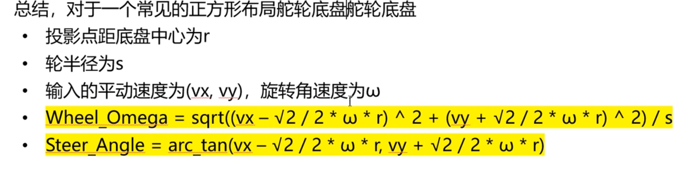

# sentry_chassis_controller内容说明
## 简介
**此pkg包含以下内容：**
- PID控制轮子速度
- 使用逆运动学计算各个轮子的期望速度
- 使用正运动学实现里程计
- 使用tf计算实现世界坐标下的速度控制
- 使用键盘操控底盘
- 实现小陀螺
- 实现功率控制
- 实现自锁
- ...
### 目录结构
- src/sentry_chassis_contrller
    - config
    - doc
    - include
    - src
    - CMakeLists.txt
    - package.xml

## 主要功能说明
### PID控制轮子速度
- 在`sentry_chassis_controller.h`中定义了四个`hardware_interface::JointHandle`类型的成员变量，分别对应四个轮子的轮速电机。
- 在`sentry_chassis_controller.cpp`的`init`函数中，加载了每个轮子的速度PID参数，并初始化了四个PID控制器。
- 在`update`函数中，根据期望速度和当前速度计算控制输出，并将其应用于轮速电机。
### 运动学计算
- 在`kinematics.h`中定义了运动学相关的函数声明。

- 在`kinematics.cpp`中实现了逆运动学和正运动学的计算函数。

- 逆运动学函数根据底盘的线速度和角速度计算各个轮子的期望速度。

- 正运动学函数根据各个轮子的实际速度计算底盘的线速度和角速度。
  

正运动学：

逆运动学：

### 里程计和tf

  linser：x: 1.0 y: 0.0 z: 0.0
  angular: x: 0.0 y: 0.0 z: 0.5
->      wheel_speed = {16.61, 16.61, 16.61, 16.61};
        steering_angle = {1.47, 1.47, 1.47, 1.47};

[INFO] [1764475698.689002721, 11.584000000]: 正运动学解算结果: vx=2.17, vy=0.22, omega=0.00 